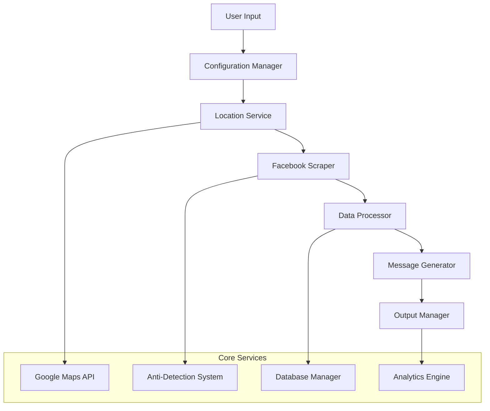
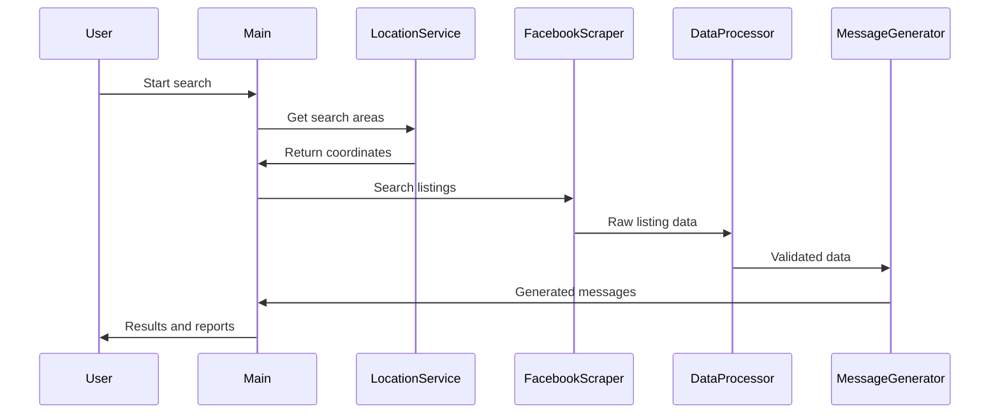

# System Patterns: Dublin Accommodation Automation Bot

## Architecture Overview

### High-Level System Design


### Component Architecture

#### 1. Service Layer Pattern
**Location**: `src/services/`
- **Purpose**: Encapsulates business logic and external integrations
- **Components**:
  - `googleMaps.js`: Location services and geocoding
  - `facebookScraper.js`: Marketplace automation
  - `messageGenerator.js`: Communication templates
  - `database.js`: Data persistence and analytics

#### 2. Utility Layer Pattern
**Location**: `src/utils/`
- **Purpose**: Shared functionality and helper methods
- **Components**:
  - `dataProcessor.js`: Validation and transformation
  - `antiDetection.js`: Stealth browsing techniques
  - `storage.js`: File system operations
  - `analytics.js`: Data analysis and reporting

#### 3. Configuration Layer Pattern
**Location**: `src/config/`
- **Purpose**: Environment and application settings
- **Components**:
  - `settings.js`: Application configuration
  - `locations.js`: Dublin area definitions
  - `userProfile.js`: Target user characteristics

## Key Technical Decisions

### 1. Browser Automation Technology
**Decision**: Migrated from Puppeteer to Playwright
**Rationale**:
- 40-60% improvement in anti-detection capabilities
- Better cross-browser support and reliability
- Enhanced debugging and error handling
- More stable API for Facebook's dynamic interface

**Implementation Pattern**:
```javascript
// Anti-detection browser setup
const { chromium } = require('playwright');
const browser = await chromium.launch({
  headless: false,
  args: ['--disable-blink-features=AutomationControlled']
});
```

### 2. Data Storage Strategy
**Decision**: JSON-based database with file system storage
**Rationale**:
- Simplicity for single-user application
- Easy data inspection and debugging
- No external database dependencies
- Efficient for read-heavy workloads

**Storage Pattern**:
```
data/
├── listings/          # Raw scraped data
├── processed/         # Validated and analyzed data
├── messages/          # Generated communications
└── hosts/            # Host profile information
```

### 3. Anti-Detection Architecture
**Decision**: Multi-layered stealth approach
**Components**:
- **Browser Fingerprinting**: Randomized user agents and viewport sizes
- **Behavioral Mimicking**: Human-like delays and mouse movements
- **Rate Limiting**: Adaptive throttling based on response patterns
- **Session Management**: Proper authentication and cookie handling

### 4. Location Service Design
**Decision**: Hybrid approach with Google Maps API and fallback
**Pattern**:
- Primary: Google Maps API for accurate geocoding
- Fallback: Haversine formula for distance calculations
- Caching: Local storage of frequently accessed coordinates

## Design Patterns in Use

### 1. Factory Pattern
**Usage**: Browser instance creation
**Location**: `src/services/facebookScraper.js`
```javascript
class BrowserFactory {
  static async createBrowser(options = {}) {
    return await chromium.launch({
      headless: options.headless || false,
      args: this.getAntiDetectionArgs()
    });
  }
}
```

### 2. Strategy Pattern
**Usage**: Message template selection
**Location**: `src/services/messageGenerator.js`
```javascript
class MessageStrategy {
  constructor() {
    this.templates = {
      freeAccommodation: new FreeAccommodationTemplate(),
      workExchange: new WorkExchangeTemplate(),
      lowCost: new LowCostTemplate()
    };
  }
  
  selectTemplate(listingAnalysis) {
    // Strategy selection logic
  }
}
```

### 3. Observer Pattern
**Usage**: Progress tracking and logging
**Location**: `src/utils/progressTracker.js`
```javascript
class ProgressTracker {
  constructor() {
    this.observers = [];
  }
  
  notify(event, data) {
    this.observers.forEach(observer => observer.update(event, data));
  }
}
```

### 4. Command Pattern
**Usage**: CLI operations and batch processing
**Location**: `src/main.js`
```javascript
class SearchCommand {
  constructor(options) {
    this.options = options;
  }
  
  async execute() {
    // Command execution logic
  }
}
```

## Component Relationships

### 1. Data Flow Architecture


### 2. Service Dependencies
- **Main Application** depends on all services
- **Facebook Scraper** depends on Anti-Detection utilities
- **Data Processor** depends on Location Service for distance calculations
- **Message Generator** depends on Data Processor for listing analysis
- **Analytics Engine** depends on Database Manager for data access

## Error Handling Patterns

### 1. Circuit Breaker Pattern
**Usage**: Facebook API rate limiting
**Implementation**: Automatic backoff when detection is suspected

### 2. Retry Pattern
**Usage**: Network requests and browser operations
**Configuration**: Exponential backoff with maximum retry limits

### 3. Graceful Degradation
**Usage**: Google Maps API failures
**Fallback**: Haversine distance calculations when API unavailable

## Performance Optimization Patterns

### 1. Lazy Loading
**Usage**: Browser initialization and service instantiation
**Benefit**: Faster startup times and reduced memory usage

### 2. Caching Strategy
**Usage**: Location coordinates and frequently accessed data
**Implementation**: In-memory cache with TTL expiration

### 3. Batch Processing
**Usage**: Multiple listing analysis and message generation
**Optimization**: Reduced API calls and improved throughput

## Security Patterns

### 1. Environment Variable Pattern
**Usage**: API keys and sensitive configuration
**Implementation**: `.env` file with validation

### 2. Input Validation Pattern
**Usage**: All user inputs and external data
**Implementation**: Comprehensive sanitization and type checking

### 3. Rate Limiting Pattern
**Usage**: External API calls and browser automation
**Implementation**: Token bucket algorithm with adaptive rates

## Testing Patterns

### 1. Mock Pattern
**Usage**: External service dependencies
**Implementation**: Configurable mocks for Google Maps and Facebook

### 2. Integration Testing Pattern
**Usage**: End-to-end workflow validation
**Implementation**: Real browser automation with test data

### 3. Snapshot Testing Pattern
**Usage**: Message template validation
**Implementation**: Expected output comparison for consistency

## Monitoring and Logging Patterns

### 1. Structured Logging
**Usage**: All application events and errors
**Format**: JSON with consistent field naming

### 2. Metrics Collection
**Usage**: Performance and success rate tracking
**Implementation**: Time-series data with aggregation

### 3. Health Check Pattern
**Usage**: Service availability monitoring
**Implementation**: Periodic validation of external dependencies